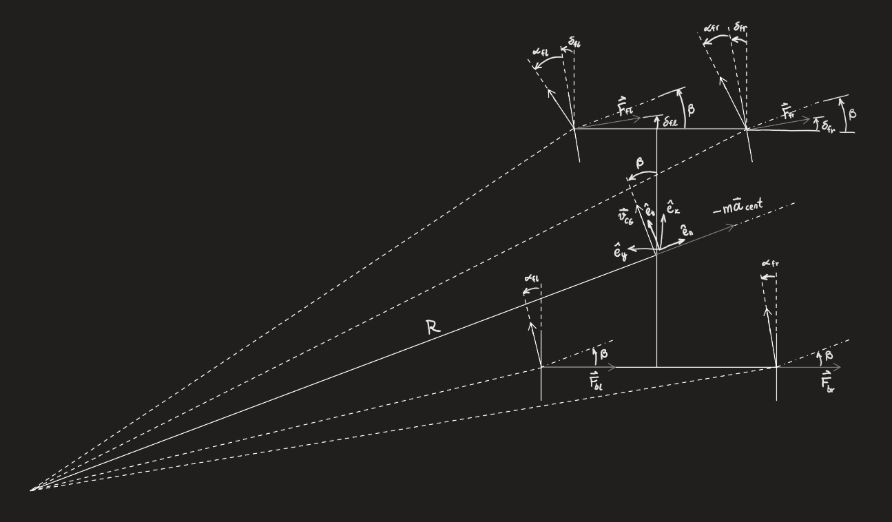
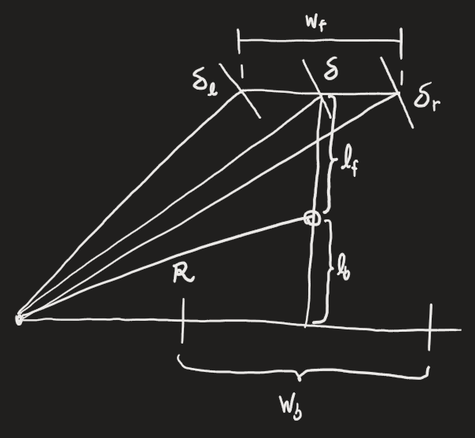
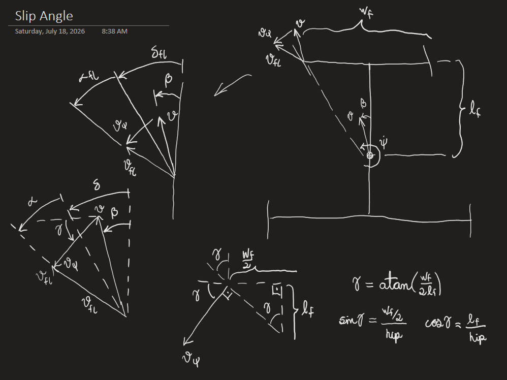

# Lateral Dynamics Simulation

## Project Description

This project uses Python to solve the movement equations governing lateral movement of a two-axle, front-axle-steered road vehicle using pneumatic tires.

## Reference Frames

### **Illustration** (Reference Frames)



### Angle Measurement

All angles are defined as positive in the counter-clockwise direction and are measured **from vehicle/wheel** axis **to velocity vector**.

### Vehicle Reference Frame $(ê_x, ê_y)$

The vehicle reference frame has its **origin** at the vehicle **center of gravity (CG)**. The **x-axis** is **parallel** to the **vehicle longitudinal axis**, with **positive direction** pointing **towards the direction of travel**. The **y-axis** points to the **left** of the vehicle.

### CG-Velocity Reference Frame $(ê_n, ê_t)$

The CG-velocity reference frame is a **normal-tangential** reference with respect to the **CG-velocity**. It also has its **origin** at the vehicle **CG**. The orientation difference between the two reference frames is the vehicle **sideslip angle** ($\beta$), as it can be seen in the [illustration](#illustration-reference-frames).

## Model Inputs

### Vehicle Properties

Vehicle physical characteristics are contained within the class **Vehicle**.

```python
@dataclass
class Vehicle:
    track_back_m: float = 1.5
    track_front_m: float = 1.5
    cg_to_front_m: float = 2.0
    cg_to_back_m: float = 2.0
    mass_kg: float = 1000
    yaw_inertia_multiplier: float = 1.0
    yaw_inertia_kgm2: float = np.nan
    steer_ratio_before_over_after_rack: float = 1.0
    toe_out_front_deg: float = 0.0
    toe_out_back_deg:  float = 0.0
    ackermann_factor: float = 1.0
```

The _**yaw_inertia_kgm2**_ parameter is has no default value, but an estimation can be done after the vehicle instantiation by using the method _**yaw_inertia_estimation_kgm2()**_. This method estimates the yaw inertia based on the vehicle's mean track width and wheelbase using the expression for the polar moment of inertia of a filled rectangle:

$$ I_{rect} = \frac{1}{12}m(b^2+h^2) $$

The product of the previous expression is multiplied by _**yaw_inertia_multiplier**_ and returned by the method.

### Tire Properties

Tire physical characteristics are contained within the class **Tire**.

```python
@dataclass
class Tire:
    cornering_stiffness_NperRad: float = 30000.0
    relaxation_length_m: float = 0.3
```

## Calculation of Wheel Angles

### Steering Angles

#### **Output** (Steering Angles)

- $\delta_l$ : Steering angle of the **left** wheel
- $\delta_r$ : Steering angle of the **right** wheel

#### **Input** (Steering Angles)

- $\delta$ : Steering angle without compensation for the vehicle's track width
- $w_f$ : Front axle track width
- $w_b$ : Back (rear) axle track width
- $l_f$ : Distance between CG and front axle
- $l_b$ : Distance between CG and back axle
- $R$ : Turning radius
- $k_{ack}$ : Ackermann geometry factor

#### **Illustration** (Steering Angles)

The geometric construction during a left-hand turn is shown below:



#### **Equations** (Steering Angles)

From the geometry, it follows that the steering angle without track width compensation is

$$ \tan\delta = \frac{l_f+l_b}{\sqrt{R^2-l_b^2}} $$

and the compensated steering angles for left and right wheels are

$$ \tan\delta_l = \tan\delta \bigg/ \left(1 - \frac{w_f}{2}\frac{k_{ack}}{\sqrt{R^2-l_b^2}} \right) $$

$$ \tan\delta_r = \tan\delta \bigg/ \left(1 + \frac{w_f}{2}\frac{k_{ack}}{\sqrt{R^2-l_b^2}} \right) $$

If $\delta$ is assumed to be small, then $R >> l_b$ and the equations become

$$ \delta = \frac{l_f+l_b}{R} $$

$$ \delta_l = \delta \bigg/ \left(1 - \frac{w_f}{2}\frac{k_{ack}}{R} \right) $$

$$ \delta_r = \delta \bigg/ \left(1 + \frac{w_f}{2}\frac{k_{ack}}{R} \right) $$

For a single-track model, $w_f = 0$ and thus

$$ \delta = \delta_l = \delta_r $$

Additionally, the previous equality is also true if the Ackermann factor $k_{ack}$ is set to 0, which means there's no Ackermann steering compensation. If $k_{ack} > 0$, the steering angle of the wheel internal to the curve will be higher than the steering angle of the outer wheel. For $k_{ack} = 1$, the steering follows the Ackermann geometry. Values higher than 1 (overcompensation) and lower than 0 (inverted compensation) are also possible.

### Static Tire Slip Angles

#### **Output** (Static Tire Slip Angles)

If the **single-track model** option is selected:

- $\alpha_f$ : Slip angle of the front tire
- $\alpha_b$ : Slip angle of the back tire

If the **double-track model** option is selected:

- $\alpha_{fl}$ : Slip angle of the front left tire
- $\alpha_{fr}$ : Slip angle of the front right tire
- $\alpha_{bl}$ : Slip angle of the back left tire
- $\alpha_{br}$ : Slip angle of the back right tire

#### **Input** (Static Tire Slip Angles)

- $l_f$ : Distance between CG and front axle
- $l_b$ : Distance between CG and back axle
- $\beta$ : Sideslip angle
- $v$ : Velocity magnitude at the CG
- $\dot\psi$ : Yaw velocity

If the **single-track model** option is selected:

- $\delta$ : Steering angle

If the **double-track model** option is selected:

- $w_f$ : Front axle track width
- $w_b$ : Back axle track width
- $\delta_l$ : Steering angle of the **left** wheel
- $\delta_r$ : Steering angle of the **right** wheel

#### **Illustration** (Static Tire Slip Angles)

The velocity at the front left wheel and its components is depicted below:



#### **Equations** (StaticTire Slip Angles)

The velocity at any wheel is given by the sum of the CG velocity and the velocity due to the yaw velocity:

$$ \vec v_{wheel} = \vec v_{CG} + \vec v_{\psi} $$

In the vehicle reference frame, the CG velocity is

$$ \vec v_{CG} = v(\cos\beta ê_x + \sin\beta ê_y) $$

The velocity component due to the yaw velocity is given by

$$ \vec v_{\psi} = \frac{d\vec\psi}{dt} \times \vec r $$

where $\vec r$ is the position of the wheel with respect to the vehicle CG. For the [depicted case](#illustration-tire-slip-angles), the position is

$$ \vec r = l_f ê_x + \frac{w_f}{2} ê_y $$

The yaw angular velocity vector is

$$ \frac{d\vec\psi}{dt} = \dot\psi ê_z $$

Substituting the two previous expressions into the expression for $\vec v_\psi$:

$$ \vec v_\psi = (\dot\psi ê_z) \times (l_f ê_x + \frac{w_f}{2} ê_y) $$

$$ \vec v_\psi = \dot\psi \left( l_f (ê_z \times ê_x) + \frac{w_f}{2}(ê_z \times ê_y) \right) $$

and thus the velocity component due to the yaw rotation is

$$ \vec v_\psi = \dot\psi \left(-\frac{w_f}{2}ê_x + l_f ê_y \right) $$

Substituting the expressions for $\vec v_{CG}$ and $\vec v_\psi$ into the expression for $\vec v_{wheel}$ (for the [depicted case](#illustration-tire-slip-angles), $\vec v_{wheel} = \vec v_{fl}$, the front left wheel velocity):

$$ v_{fl,x} = v \cos\beta - \dot\psi \frac{w_f}{2} $$

$$ v_{fl,y} = v \sin\beta + \dot\psi l_f $$

The slip angle $\alpha_{fl}$ is the difference between the wheel velocity vector direction and the steering angle $\delta_{fl}$:

$$ \alpha_{fl} = \arctan \left(\frac{v_{fl,y}}{v_{fl,x}} \right) - \delta_{fl} $$

and thus

$$ \alpha_{fl} = \arctan \left(\frac{v \sin\beta + \dot\psi l_f}{v \cos\beta - \dot\psi \frac{w_f}{2}} \right) - \delta_{fl} $$

which can also be expressed as

$$ \alpha_{fl} = \arctan \left(\frac{\sin\beta + \frac{\dot\psi}{v} l_f}{ \cos\beta - \frac{\dot\psi}{v} \frac{w_f}{2}} \right) - \delta_{fl} $$

Under the assumption of small $(\alpha_{fl} + \delta_{fl})$ and small $\beta$, the expression becomes

$$ \alpha_{fl} = \frac{\beta + \frac{\dot\psi}{v} l_f}{ 1 - \frac{\dot\psi}{v} \frac{w_f}{2}} - \delta_{fl} $$

Furthermore, considering the case of a single track model ($w_f=0$), the expression (now for $\alpha_f$) simplifies to

$$ \alpha_f = \beta + \frac{\dot\psi}{v} l_f - \delta_{fl} $$

### Implementation (Calculation of Wheel Angles)

The previously detailed equations for steering and slip angles are implemented via the function `calc_wheel_angles()`, which takes the following inputs:

```python
def calc_wheel_angles(
        car: Vehicle,
        *,
        steering_wheel_input_rad: float,
        side_slip_rad: float,
        dyaw_dt_rad_s: float,
        velocity_m_s: float,
        single_track_on: bool = False,
        small_angles_on: bool = False
        ) -> WheelAngles:
```

The function returns a `WheelAngles` object, which is a container for the wheel angle related information. It is defined as

```python
@dataclass
class WheelAngles:
    steer_f: npt.ArrayLike
    steer_fl: npt.ArrayLike
    steer_fr: npt.ArrayLike
    steer_bl: npt.ArrayLike
    steer_br: npt.ArrayLike
    alpha_f: npt.ArrayLike
    alpha_fl: npt.ArrayLike
    alpha_fr: npt.ArrayLike
    alpha_b: npt.ArrayLike
    alpha_bl: npt.ArrayLike
    alpha_br: npt.ArrayLike
```

### Transient Tire Slip Angles

asdasda

## Calculation of Wheel Forces

### Input (Calculation of Wheel Forces)

- $c_f$ : Front-tire cornering stiffness
- $c_b$ : Back-tire cornering stiffness

If the **single-track model** option is selected:

- $\alpha_f$ : Slip angle of the front tire
- $\alpha_b$ : Slip angle of the back tire

If the **double-track model** option is selected:

- $\alpha_{fl}$ : Slip angle of the front left tire
- $\alpha_{fr}$ : Slip angle of the front right tire
- $\alpha_{bl}$ : Slip angle of the back left tire
- $\alpha_{br}$ : Slip angle of the back right tire

Only necessary for the calculation of forces with respect to the **CG-Velocity** [reference frame](#cg-velocity-reference-frame):

- $\beta$ : Sideslip angle

### Wheel Forces in Vehicle Reference Frame

#### **Output** (Wheel Forces in Vehicle Reference Frame)

- $F_{x,f}$ : Front-axle force in the x-direction
- $F_{y,f}$ : Front-axle force in the y-direction
- $F_{x,b}$ : Back-axle force in the x-direction
- $F_{x,b}$ : Back-axle force in the y-direction

Additionally, if the **double-track model** option is selected:

- $F_{x,fl}$ : Front-left wheel force in the x-direction
- $F_{y,fl}$ : Front-left wheel force in the y-direction
- $F_{x,fr}$ : Front-right wheel force in the x-direction
- $F_{y,fr}$ : Front-right wheel force in the y-direction
- $F_{x,bl}$ : Back-left wheel force in the x-direction
- $F_{y,bl}$ : Back-left wheel force in the y-direction
- $F_{x,br}$ : Back-right wheel force in the x-direction
- $F_{y,br}$ : Back-right wheel force in the y-direction

#### **Equations** (Wheel Forces in Vehicle Reference Frame)

Refer to the [illustration](#illustration-reference-frames) for the visualization of force direction.

If the **single-track model** option is selected:

$$ F_{x,f} = +2c_f \alpha_{f} \sin\delta_{f} $$
$$ F_{y,f} = -2c_f \alpha_{f} \cos\delta_{f} $$
$$ F_{x,b} = +2c_b \alpha_{b} \sin\delta_{b} $$
$$ F_{y,b} = -2c_b \alpha_{b} \cos\delta_{b} $$

If the **double-track model** option is selected:

For the front axle:

$$ F_{x,fl} = +c_f \alpha_{fl} \sin\delta_{fl} $$
$$ F_{y,fl} = -c_f \alpha_{fl} \cos\delta_{fl} $$
$$ F_{x,fr} = +c_f \alpha_{fr} \sin\delta_{fr} $$
$$ F_{y,fr} = -c_f \alpha_{fr} \cos\delta_{fr} $$
$$ F_{x,f} = F_{x,fl} + F_{x,fr} $$
$$ F_{y,f} = F_{y,fl} + F_{y,fr} $$

For the back axle:

$$ F_{x,bl} = +c_b \alpha_{bl} \sin\delta_{bl} $$
$$ F_{y,bl} = -c_b \alpha_{bl} \cos\delta_{bl} $$
$$ F_{x,br} = +c_b \alpha_{br} \sin\delta_{br} $$
$$ F_{y,br} = -c_b \alpha_{br} \cos\delta_{br} $$
$$ F_{x,b} = F_{x,bl} + F_{x,br} $$
$$ F_{y,b} = F_{y,bl} + F_{y,br} $$

### Wheel Forces in CG-Velocity Reference Frame

#### **Output** (Wheel Forces in CG-Velocity Reference Frame)

- $F_{n,f}$ : Front-axle force in the normal-direction
- $F_{t,f}$ : Front-axle force in the tangential-direction
- $F_{n,b}$ : Back-axle force in the normal-direction
- $F_{t,b}$ : Back-axle force in the tangential-direction

Additionally, if the **double-track model** option is selected:

- $F_{n,fl}$ : Front-left wheel force in the normal-direction
- $F_{t,fl}$ : Front-left wheel force in the tangential-direction
- $F_{n,fr}$ : Front-right wheel force in the normal-direction
- $F_{t,fr}$ : Front-right wheel force in the tangential-direction
- $F_{n,bl}$ : Back-left wheel force in the normal-direction
- $F_{t,bl}$ : Back-left wheel force in the tangential-direction
- $F_{n,br}$ : Back-right wheel force in the normal-direction
- $F_{t,br}$ : Back-right wheel force in the tangential-direction

#### **Equations** (Wheel Forces in CG-Velocity Reference Frame)

If the **single-track model** option is selected:

$$ F_{t,f} = +2c_f \alpha_f \sin(\beta - \delta_f) $$
$$ F_{n,f} = -2c_f \alpha_f \cos(\beta - \delta_f) $$
$$ F_{t,b} = +2c_b \alpha_b \sin(\beta - \delta_b) $$
$$ F_{n,b} = -2c_b \alpha_b \cos(\beta - \delta_b) $$

If the **double-track model** option is selected:

For the front axle:

$$ F_{t,fl} = +c_f \alpha_{fl} \sin(\beta - \delta_{fl}) $$
$$ F_{n,fl} = -c_f \alpha_{fl} \cos(\beta - \delta_{fl}) $$
$$ F_{t,fr} = +c_f \alpha_{fr} \sin(\beta - \delta_{fr}) $$
$$ F_{n,fr} = -c_f \alpha_{fr} \cos(\beta - \delta_{fr}) $$
$$ F_{t,f} = F_{t,fl} + F_{t,fr} $$
$$ F_{n,f} = F_{n,fl} + F_{n,fr} $$

For the back axle:

$$ F_{t,bl} = +c_b \alpha_{bl} \sin(\beta - \delta_{bl}) $$
$$ F_{n,bl} = -c_b \alpha_{bl} \cos(\beta - \delta_{bl}) $$
$$ F_{t,br} = +c_b \alpha_{br} \sin(\beta - \delta_{br}) $$
$$ F_{n,br} = -c_b \alpha_{br} \cos(\beta - \delta_{br}) $$
$$ F_{t,b} = F_{t,bl} + F_{t,br} $$
$$ F_{n,b} = F_{n,bl} + F_{n,br} $$

### Implementation (Calculation of Wheel Forces)

The previously detailed equations for wheel forces are implemented via the function `calc_wheel_forces()`, which takes the following inputs:

```python
def calc_wheel_forces(
        *,
        tire_front: Tire,
        tire_rear: Tire,
        wheel_angles: WheelAngles,
        side_slip_rad: float,
        single_track_on: bool = False,
        small_angles_on: bool = False
        ) -> WheelForces:
```

The function returns a `WheelForces` object, which is a container for the wheel force related information. It is defined as

```python
@dataclass
class WheelForces:
    Fx_f: npt.ArrayLike
    Fy_f: npt.ArrayLike
    Fx_b: npt.ArrayLike
    Fy_b: npt.ArrayLike
    Fn_f: npt.ArrayLike
    Ft_f: npt.ArrayLike
    Fn_b: npt.ArrayLike
    Ft_b: npt.ArrayLike
    Fx_fl: npt.ArrayLike
    Fy_fl: npt.ArrayLike
    Fx_fr: npt.ArrayLike
    Fy_fr: npt.ArrayLike
    Fx_bl: npt.ArrayLike
    Fy_bl: npt.ArrayLike
    Fx_br: npt.ArrayLike
    Fy_br: npt.ArrayLike
    Fn_fl: npt.ArrayLike
    Ft_fl: npt.ArrayLike
    Fn_fr: npt.ArrayLike
    Ft_fr: npt.ArrayLike
    Fn_bl: npt.ArrayLike
    Ft_bl: npt.ArrayLike
    Fn_br: npt.ArrayLike
    Ft_br: npt.ArrayLike
```

## Calculation of Wheel Moments

### Input (Calculation of Wheel Moments)

- $w_f$ : Front axle track width
- $w_b$ : Back (rear) axle track width
- $l_f$ : Distance between CG and front axle
- $l_b$ : Distance between CG and back axle
- $F_{x,f}$ : Front-axle force in the x-direction
- $F_{y,f}$ : Front-axle force in the y-direction
- $F_{x,b}$ : Back-axle force in the x-direction
- $F_{x,b}$ : Back-axle force in the y-direction

### Output (Calculation of Wheel Moments)

- $M_{z,f}$ : Front-axle yaw moment
- $M_{z,b}$ : Back-axle yaw moment

Additionally, if the **double-track model** option is selected:

- $M_{z,fl}$ : Front-left wheel yaw moment
- $M_{z,fr}$ : Front-left wheel yaw moment
- $M_{z,bl}$ : Front-right wheel yaw moment
- $M_{z,br}$ : Front-right wheel yaw moment

### Equations (Calculation of Wheel Moments)

If the **single-track model** option is selected:

$$ M_{z,f} = +l_f F_{y,f} $$
$$ M_{z,b} = -l_b F_{y,b} $$

If the **double-track model** option is selected:

$$ M_{z,fl} = +l_f F_{y,fl} - \frac{w_f}{2} F_{x,fl} $$
$$ M_{z,fr} = +l_f F_{y,fr} + \frac{w_f}{2} F_{x,fr} $$
$$ M_{z,bl} = -l_b F_{y,bl} - \frac{w_b}{2} F_{x,bl} $$
$$ M_{z,br} = -l_b F_{y,br} + \frac{w_b}{2} F_{x,br} $$

$$ M_{z,f} = M_{z,fl} + M_{z,fr} $$
$$ M_{z,b} = M_{z,bl} + M_{z,br} $$

### Implementation (Calculation of Wheel Moments)

The previously detailed equations for wheel moments are implemented via the function `calc_wheel_moments()`, which takes the following inputs:

```python
def calc_wheel_moments(
        car: Vehicle,
        wheel_forces: WheelForces,
        single_track_on: bool = False
        ) -> WheelMoments:
```

The function returns a `WheelMoments` object, which is a container for the wheel moment related information. It is defined as

```python
@dataclass
class WheelMoments:
    Myaw_f: npt.ArrayLike
    Myaw_fl: npt.ArrayLike
    Myaw_fr: npt.ArrayLike
    Myaw_b: npt.ArrayLike
    Myaw_bl: npt.ArrayLike
    Myaw_br: npt.ArrayLike
```

## Steady State Cornering